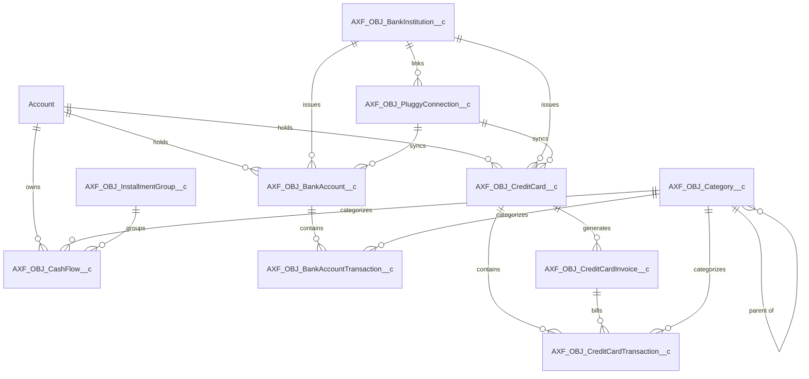

# 📖 Axon Finance — Project Wiki & Technical Architecture Manual

Welcome to the **Axon Finance** Project Wiki. This document serves as the single source of truth for the product requirements, business domain model, system architecture, integration flows, and frontend design system built on Salesforce Lightning Platform and Pluggy Open Finance API.

---

## 📑 Table of Contents

1. [Executive Summary & Product Vision](#1-executive-summary--product-vision)
2. [Business Analyst View (Domain & Requirements)](#2-business-analyst-view-domain--requirements)
   - [2.1 Core User Personas](#21-core-user-personas)
   - [2.2 Epics & User Stories Traceability Index](#22-epics--user-stories-traceability-index)
   - [2.3 Functional Modules](#23-functional-modules)
3. [System Architecture & Data Model (Winston's Blueprint)](#3-system-architecture--data-model-winstons-blueprint)
   - [3.1 Salesforce Naming Conventions & Metadata Architecture](#31-salesforce-naming-conventions--metadata-architecture)
   - [3.2 Entity Relationship Diagram (Data Model)](#32-entity-relationship-diagram-data-model)
   - [3.3 Object Directory & Key Custom Fields](#33-object-directory--key-custom-fields)
4. [Integration Architecture (Pluggy Open Finance API)](#4-integration-architecture-pluggy-open-finance-api)
   - [4.1 Security & Authentication Architecture](#41-security--authentication-architecture)
   - [4.2 Synchronization Engine (Queueable, Schedulable & Rate Limiting)](#42-synchronization-engine-queueable-schedulable--rate-limiting)
   - [4.3 Cash Flow Forecast Engine (Recurring & PRICE-Financing Rolling Horizon)](#43-cash-flow-forecast-engine-recurring--price-financing-rolling-horizon)
5. [Frontend Architecture & Design System (LWC Suite)](#5-frontend-architecture--design-system-lwc-suite)
   - [5.1 Component Hierarchy & Layout Strategy](#51-component-hierarchy--layout-strategy)
   - [5.2 Key LWC Modules Reference](#52-key-lwc-modules-reference)
6. [Apex Core Framework & Trigger Architecture](#6-apex-core-framework--trigger-architecture)
   - [6.1 Trigger Handler Pattern (`AXF_CLS_*Handler`)](#61-trigger-handler-pattern-axf_cls_handler)
   - [6.2 Key Services & Controllers](#62-key-services--controllers)
7. [Operations & Development Guidelines](#7-operations--development-guidelines)

---

## 1. Executive Summary & Product Vision

**Axon Finance** is an enterprise-grade Personal and Multi-Account Financial Intelligence application natively built on Salesforce Lightning Platform. It connects securely with Brazilian financial institutions through **Pluggy Open Finance API**, consolidating bank accounts, credit cards, real-time balances, credit card statements, investments, loans, and manual/automated cash flow planning into a single unified workspace.

### Key Value Drivers:

- **Unified Open Finance Hub:** Automated multi-bank account and credit card aggregation.
- **Smart Cash Flow & Investment Capacity:** Dynamic KPI engine calculating real-time cash flow surplus and investment potential per account holder.
- **Resilient Architectural Core:** Automated retry backoff handling, Platform Cache token reuse, and strict rate-limit management.
- **Standardized UI/UX Suite:** Dark-theme responsive LWC components for quick entries, statements, and financial health monitoring.

---

## 2. Business Analyst View (Domain & Requirements)

### 2.1 Core User Personas

| Persona                     | Description                                                            | Key Objectives                                                                                                          |
| --------------------------- | ---------------------------------------------------------------------- | ----------------------------------------------------------------------------------------------------------------------- |
| **Account Holder (User)**   | Individual managing personal or family finances across multiple banks. | View consolidated balances, track monthly budget surplus, manage credit card invoices, and log quick expenses/revenues. |
| **Financial Administrator** | Manages multi-holder accounts (e.g. Michel Lopes / Gisele Lopes).      | Filter metrics per account holder, audit manual transactions against Open Finance data, and trigger forced syncs.       |
| **Integration Service**     | Automated background service executing Open Finance sync.              | Authenticate securely, fetch delta transactions, update account balances, and handle API rate limits gracefully.        |

### 2.2 Epics & User Stories Traceability Index

The system has evolved across major development epics and stories:

| Epic / Story Tag    | Title / Scope                               | Business Value                                                                               | Status    |
| ------------------- | ------------------------------------------- | -------------------------------------------------------------------------------------------- | --------- |
| **EPIC-003**        | Core Infrastructure & Data Model Foundation | Establishes custom objects (`AXF_OBJ_*`), permission sets, and app layout.                   | Completed |
| **EPIC-004**        | Pluggy Open Finance API Integration         | Direct integration with Pluggy API for accounts, bills, and transactions.                    | Completed |
| **EPIC-005**        | Resilience, Performance & Infrastructure    | Platform Cache, Rate Limit (429) retry backoff, error logging.                               | Completed |
| **EPIC-006**        | UX & Real-Time Synchronization              | LWC statements, quick actions, and responsive home page dashboards.                          | Completed |
| **US-080 / US-087** | Investment Capacity KPI Refactoring         | Multi-account holder tabset filtering (Geral, Michel Lopes, Gisele Lopes).                   | Completed |
| **BUG-018**         | Investment Capacity Tab Refresh Fix         | Reactive re-querying of metrics upon account holder tab selection.                           | Completed |
| **US-089**          | Mandatory Account Lookup on Cash Flow       | Ensures all `AXF_OBJ_CashFlow__c` records belong to an `Account`.                            | Completed |
| **US-090**          | Period Filter Parameters in Manual Sync     | Sends `dateFrom` & `dateTo` (`YYYY-MM-DD`) query parameters to Pluggy `/v2/transactions`.    | Completed |
| **US-091**          | Quick Category Creation in Entry Modal      | Enables inline creation of `AXF_OBJ_Category__c` without closing `aXF_LWC_quickFlowActions`. | Completed |
| **US-092**          | Standardized Account Card & Bank Naming     | Standardizes record names to `{Account Name} - {Bank Institution Name}` in uppercase.        | Completed |

---

## 3. System Architecture & Data Model (Winston's Blueprint)

### 3.1 Salesforce Naming Conventions & Metadata Architecture

All metadata components follow strict prefix rules specified in `PROJECT_RULES.md`:

- **Apex Class / Trigger:** `AXF_CLS_*` / `AXF_TRG_*`
- **Trigger Handler:** `AXF_CLS_*Handler` (one per trigger; enforced by `scripts/ci/trigger-handler-boundary.mjs`, AXF-105)
- **Lightning Web Components:** `aXF_LWC_*`
- **Custom Objects / FlexiPages:** `AXF_OBJ_*` / `AXF_RPL_*`
- **Credentials:** `AXF_NC_*` (Named Credential) / `AXF_EXC_*` (External Credential)
- **Custom Fields Pattern:** `AXF_{Sigla}_{fieldTypePrefix}_{FieldEnglishName}__c`
  - _Siglas:_ `BA` (BankAccount), `CC` (CreditCard), `CCI` (CreditCardInvoice), `CF` (CashFlow), `CAT` (Category), `BI` (BankInstitution), `CON` (PluggyConnection), `CCT` (CreditCardTransaction), `BAT` (BankAccountTransaction).

### 3.2 Entity Relationship Diagram (Data Model)


```mermaid
erDiagram
    Account ||--o{ AXF_OBJ_BankAccount__c : "holds"
    Account ||--o{ AXF_OBJ_CreditCard__c : "holds"
    Account ||--o{ AXF_OBJ_CashFlow__c : "owns"

    AXF_OBJ_BankInstitution__c ||--o{ AXF_OBJ_BankAccount__c : "issues"
    AXF_OBJ_BankInstitution__c ||--o{ AXF_OBJ_CreditCard__c : "issues"
    AXF_OBJ_BankInstitution__c ||--o{ AXF_OBJ_PluggyConnection__c : "links"

    AXF_OBJ_PluggyConnection__c ||--o{ AXF_OBJ_BankAccount__c : "syncs"
    AXF_OBJ_PluggyConnection__c ||--o{ AXF_OBJ_CreditCard__c : "syncs"

    AXF_OBJ_BankAccount__c ||--o{ AXF_OBJ_BankAccountTransaction__c : "contains"

    AXF_OBJ_CreditCard__c ||--o{ AXF_OBJ_CreditCardInvoice__c : "generates"
    AXF_OBJ_CreditCard__c ||--o{ AXF_OBJ_CreditCardTransaction__c : "contains"

    AXF_OBJ_CreditCardInvoice__c ||--o{ AXF_OBJ_CreditCardTransaction__c : "bills"

    AXF_OBJ_Category__c ||--o{ AXF_OBJ_Category__c : "parent of"
    AXF_OBJ_Category__c ||--o{ AXF_OBJ_BankAccountTransaction__c : "categorizes"
    AXF_OBJ_Category__c ||--o{ AXF_OBJ_CreditCardTransaction__c : "categorizes"
    AXF_OBJ_Category__c ||--o{ AXF_OBJ_CashFlow__c : "categorizes"

    AXF_OBJ_InstallmentGroup__c ||--o{ AXF_OBJ_CashFlow__c : "groups"
```

---

## 4. Integration Architecture (Pluggy Open Finance API)

### 4.1 Security & Authentication Architecture

- **Named Credential:** `callout:AXF_NC_Pluggy_API` pointing to `https://api.pluggy.ai`.
- **Authentication Service (`AXF_CLS_PluggyAuthService`):**
  - Sends `clientId` and `clientSecret` to `/auth`.
  - Caches valid API Key in **Salesforce Platform Cache** (`local.AXF_Partition`) to eliminate redundant HTTP auth round-trips.

### 4.2 Synchronization Engine (Queueable, Schedulable & Rate Limiting)

- **`AXF_CLS_PluggyItemSyncScheduler`:** Runs daily background cron sync.
- **`AXF_CLS_PluggyItemSyncQueueable`:** Asynchronous queueable execution processing item connections, bank accounts, credit cards, invoices, transactions, investments, and loans.
- **Rate Limit Resilience (HTTP 429):**
  - `AXF_CLS_PluggyTxSync_Service` handles cursor-based pagination for `/v2/transactions`.
  - When Pluggy returns HTTP 429, throws `RateLimitException` with `resumeCursor` and `retryAfterSeconds`.
  - Enqueues `AXF_CLS_PluggyRetryScheduler` to resume execution seamlessly from the exact cursor location.

### 4.3 Cash Flow Forecast Engine (Recurring & PRICE-Financing Rolling Horizon)

- **`ALT_CLS_CashFlowForecast.FUTURE_HORIZON_MONTHS`** (6): every open-ended
  `RECORRENTE` `AXF_OBJ_InstallmentGroup__c` and every `FINANCIAMENTO`/`PRICE`
  group must always have entries projected this many months ahead of today.
- **At creation (`ALT_CLS_CashFlowHome.createCashFlowSeries`):** a new
  `RECORRENTE` series materializes `FUTURE_HORIZON_MONTHS + 1` occurrences
  immediately (PRICE financing already did this via
  `ALT_CLS_PriceFinancing.initialWindow`).
- **Monthly top-up (`AXF_CLS_CashFlowForecastScheduler`):** a `Schedulable`
  job that calls `ALT_CLS_CashFlowForecast.extendActiveGroups()`, adding
  exactly one further occurrence to every active RECURRING or PRICE-financing
  group whose latest entry is less than `FUTURE_HORIZON_MONTHS` away, keeping
  pace with time so the horizon never shrinks.
- **⚠️ Production activation required:** deploying the class does **not**
  register the CRON job. After promoting to a new org (including `AXON_PROD`),
  an admin must run once:
  ```apex
  AXF_CLS_CashFlowForecastScheduler.scheduleMonthly();
  ```
  via anonymous Apex (or Setup → Apex Classes → Schedule Apex, class
  `AXF_CLS_CashFlowForecastScheduler`, monthly on day 1). Verify with
  `SELECT Id, CronExpression, NextFireTime FROM CronTrigger WHERE CronJobDetail.Name = 'AXF Cash Flow Forecast - Monthly'`.
  Scheduled in `AXON_DEV` on 2026-09-28; the same step is still pending for
  `AXON_PROD`.

---

## 5. Frontend Architecture & Design System (LWC Suite)

### 5.1 Component Hierarchy & Layout Strategy

All LWC components adhere to Salesforce SLDS and modern dark-theme aesthetics (`#0A192F` container backgrounds, vibrant status badges, responsive SLDS grids).

```
aXF_HPL_HomePage (FlexiPage)
 ├── aXF_LWC_realTimeBalance (Global Real-time Net Worth & Sync Bar)
 ├── aXF_LWC_investmentCapacityKpi (Investment Capacity & Holder Tabset)
 ├── aXF_LWC_quickFlowActions (Nova Despesa / Nova Receita Modal & Quick Category Creation)
 ├── aXF_LWC_expenseHomeTable (Monthly Expense Grid)
 └── aXF_LWC_revenueHomeTable (Monthly Revenue Grid)
```

---

## 6. Apex Core Framework & Trigger Architecture

### 6.1 Trigger Handler Pattern (`AXF_CLS_*Handler`)

Every Apex trigger contains only context dispatch and delegation to exactly one
`AXF_CLS_*Handler` class (AXF-105). Business rules — queries, DML, validation,
calculations, field changes — live in the handler or in the `ALT_CLS_*` business
service it calls. CI enforces the boundary with
`node scripts/ci/trigger-handler-boundary.mjs` (one trigger per object, only
`Trigger.*` context arguments, handler class must exist).

```apex
trigger AXF_TRG_Example on AXF_OBJ_Example__c(before insert, before update) {
  if (Trigger.isBefore && Trigger.isInsert) {
    AXF_CLS_ExampleTriggerHandler.handleBeforeInsert(Trigger.new);
  }
  if (Trigger.isBefore && Trigger.isUpdate) {
    AXF_CLS_ExampleTriggerHandler.handleBeforeUpdate(
      Trigger.new,
      Trigger.oldMap
    );
  }
}
```

Current pairs (see `force-app/main/default/triggers`): realization facts and
allocations (`AXF_CLS_{RA,BAT,CCT,FTX}TriggerHandler` → `ALT_CLS_RealizationGuard`),
FX snapshots/settlements, contract term versions, schedule runs, card billing
cycle rules, review items, work records and the Pluggy webhook event.

---

## 7. Operations & Development Guidelines

1. **Deployments:** Use targeted source-path deployments and the repository CI/CD workflows.
2. **Issue lifecycle:** Keep requirements and acceptance criteria in GitHub Issues.
3. **Development:** Create `feature/*` and `defect/*` branches from `develop` and integrate changes through pull requests.
4. **Production:** Promote approved changes from `develop` to `main` and use the protected `PROD` environment.
5. **Scheduled jobs:** deploying a `Schedulable` class does not register its
   CRON job. After promoting to a new org, run the class's `scheduleX()`
   method once (see [4.3](#43-cash-flow-forecast-engine-recurring--price-financing-rolling-horizon)
   for `AXF_CLS_CashFlowForecastScheduler`; the same applies to
   `AXF_CLS_PluggyItemSyncScheduler`).

---

_Axon Finance Architecture Core._
